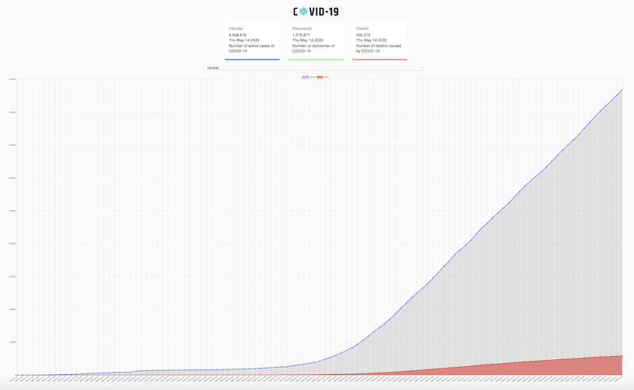

# CovidTracker
 The app fetches live covid  data from the API (https://covid19.mathdro.id/api) using Async/Await syntax. Displays 
current global infected, recovered and deaths as counts and in chart form. Country selection allow narrowing by
countries. When a country is applied a bar chart shows infected, recovered and deaths for the selected country.


### Installing

```
 
clone https://github.com/BFronz/covidtracker.git

npm install package.json

Run  npm start

```

## Built With
* React.js
* React Hooks
* Material UI
* Charts.js
* API data fetching 
* Node.js


## Special Features

Runs on heroku.com: https://thawing-meadow-92155.herokuapp.com/





## Credits
JavaScript Mastery:  <a href="https://www.youtube.com/channel/UCmXmlB4-HJytD7wek0Uo97A" target="_blank">JavaScript Mastery</a>


